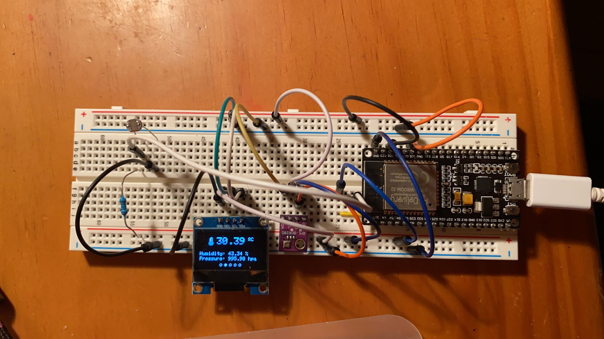
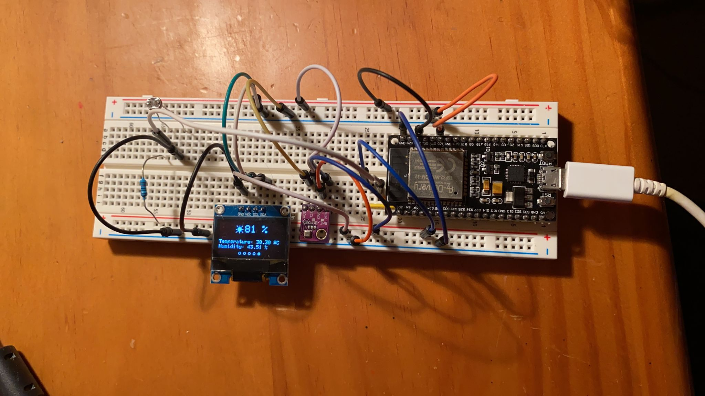

# PROYECTO FINAL: Estación meteorologica
## Código completo:
```
#include <Arduino.h>
#include <Adafruit_NeoPixel.h>
#include <Wire.h>
#include <Adafruit_GFX.h>
#include <Adafruit_SSD1306.h>
#include <Adafruit_Sensor.h>
#include <Adafruit_BME280.h>
#include <WiFi.h>
#include <time.h>
#include "Adafruit_I2CDevice.h"

//------------------Servidor Web en puerto 80---------------------
WiFiServer server(80);

// Insert your network credentials
const char* ssid     = "FRITZBox 7530 AA";
const char* password = "29204458007338454923";

//---------------------VARIABLES GLOBALES-------------------------
int contconexion = 0;

String header; // Variable para guardar el HTTP request

//------------------------CODIGO HTML------------------------------
String paginaInicio = "<!DOCTYPE html>"
"<html>"
"<head>"
"<meta charset='utf-8' />"
"<META HTTP-EQUIV='Refresh' CONTENT='1'>"
"<title> Datos meteorologicos locales actuales </title>"
"</head>"
"<body>"
"<center>"
"<h2> <u> Datos meteorologicos locales actuales </u> </h2>"
"<br>"
"</center>";

String Temperatura = 
"<h3> <ul> <li> Temperatura: </li> </ul> </h3>"
"<br>";

String Humedad = 
"<h3> <ul> <li> Humedad: </li> </ul> </h3>"
"<br>";

String Presion = 
"<h3> <ul> <li> Presion: </li> </ul> </h3>"
"<br>";

String paginaFin = 
"</body>"
"</html>";

// NTP Server Details
const char* ntpServer = "pool.ntp.org";
const long  gmtOffset_sec = 0;
const int   daylightOffset_sec = 7200;

// OLED Display
#define SCREEN_WIDTH 128  // OLED display width, in pixels
#define SCREEN_HEIGHT 64  // OLED display height, in pixels

#define I2Cdisplay_SDA 21
#define I2Cdisplay_SCL 22
TwoWire I2Cdisplay = TwoWire(1);

Adafruit_SSD1306 display(SCREEN_WIDTH, SCREEN_HEIGHT, &I2Cdisplay, -1);

// WS2812B Addressable RGB LEDs
#define LED_PIN    27  // GPIO the LEDs are connected to
#define LED_COUNT  12  // Number of LEDs
Adafruit_NeoPixel strip(LED_COUNT, LED_PIN, NEO_GRB + NEO_KHZ800);

// BME280
#define I2C_SDA 21
#define I2C_SCL 22
TwoWire I2CBME = TwoWire(0);
Adafruit_BME280 bme;

// LDR (Light Dependent Resistor)
#define ldr  33          

// Screens
int displayScreenNum = 0;
int displayScreenNumMax = 4;

unsigned long lastTimer = 0;
unsigned long timerDelay = 15000; 

unsigned char temperature_icon[] ={
  0b00000001, 0b11000000, //        ###      
  0b00000011, 0b11100000, //       #####     
  0b00000111, 0b00100000, //      ###  #     
  0b00000111, 0b11100000, //      ######     
  0b00000111, 0b00100000, //      ###  #     
  0b00000111, 0b11100000, //      ######     
  0b00000111, 0b00100000, //      ###  #     
  0b00000111, 0b11100000, //      ######     
  0b00000111, 0b00100000, //      ###  #     
  0b00001111, 0b11110000, //     ########    
  0b00011111, 0b11111000, //    ##########   
  0b00011111, 0b11111000, //    ##########   
  0b00011111, 0b11111000, //    ##########   
  0b00011111, 0b11111000, //    ##########   
  0b00001111, 0b11110000, //     ########    
  0b00000111, 0b11100000, //      ######     
};

unsigned char humidity_icon[] ={
  0b00000000, 0b00000000, //                 
  0b00000001, 0b10000000, //        ##       
  0b00000011, 0b11000000, //       ####      
  0b00000111, 0b11100000, //      ######     
  0b00001111, 0b11110000, //     ########    
  0b00001111, 0b11110000, //     ########    
  0b00011111, 0b11111000, //    ##########   
  0b00011111, 0b11011000, //    ####### ##   
  0b00111111, 0b10011100, //   #######  ###  
  0b00111111, 0b10011100, //   #######  ###  
  0b00111111, 0b00011100, //   ######   ###  
  0b00011110, 0b00111000, //    ####   ###   
  0b00011111, 0b11111000, //    ##########   
  0b00001111, 0b11110000, //     ########    
  0b00000011, 0b11000000, //       ####      
  0b00000000, 0b00000000, //                 
};

unsigned char arrow_down_icon[] ={
  0b00001111, 0b11110000, //     ########    
  0b00011111, 0b11111000, //    ##########   
  0b00011111, 0b11111000, //    ##########   
  0b00011100, 0b00111000, //    ###    ###   
  0b00011100, 0b00111000, //    ###    ###   
  0b00011100, 0b00111000, //    ###    ###   
  0b01111100, 0b00111110, //  #####    ##### 
  0b11111100, 0b00111111, // ######    ######
  0b11111100, 0b00111111, // ######    ######
  0b01111000, 0b00011110, //  ####      #### 
  0b00111100, 0b00111100, //   ####    ####  
  0b00011110, 0b01111000, //    ####  ####   
  0b00001111, 0b11110000, //     ########    
  0b00000111, 0b11100000, //      ######     
  0b00000011, 0b11000000, //       ####      
  0b00000001, 0b10000000, //        ##       
};

unsigned char sun_icon[] ={
  0b00000000, 0b00000000, //                 
  0b00100000, 0b10000010, //   #     #     # 
  0b00010000, 0b10000100, //    #    #    #  
  0b00001000, 0b00001000, //     #       #   
  0b00000001, 0b11000000, //        ###      
  0b00000111, 0b11110000, //      #######    
  0b00000111, 0b11110000, //      #######    
  0b00001111, 0b11111000, //     #########   
  0b01101111, 0b11111011, //  ## ######### ##
  0b00001111, 0b11111000, //     #########   
  0b00000111, 0b11110000, //      #######    
  0b00000111, 0b11110000, //      #######    
  0b00010001, 0b11000100, //    #   ###   #  
  0b00100000, 0b00000010, //   #           # 
  0b01000000, 0b10000001, //  #      #      #
  0b00000000, 0b10000000, //         #       
};

// Clear the LEDs
void colorWipe(uint32_t color, int wait, int numNeoPixels) {
  for(int i=0; i<numNeoPixels; i++) { // For each pixel in strip...
    strip.setPixelColor(i, color);         //  Set pixel's color (in RAM)
    strip.show();                          //  Update strip to match
    delay(wait);                           //  Pause for a moment
  }
}

// Rainbow cycle along all LEDs. Pass delay time (in ms) between frames.
void rainbow(int wait) {
  long firstPixelHue = 256;
    for(int i=0; i<strip.numPixels(); i++) { // For each pixel in strip...
      int pixelHue = firstPixelHue + (i * 65536L / strip.numPixels());
      strip.setPixelColor(i, strip.gamma32(strip.ColorHSV(pixelHue)));
    }
    strip.show(); // Update strip with new contents
    delay(wait);  // Pause for a moment
}

// Create display marker for each screen
void displayIndicator(int displayNumber) {
  int xCoordinates[5] = {44, 54, 64, 74, 84};
  for (int i =0; i<5; i++) {
    if (i == displayNumber) {
      display.fillCircle(xCoordinates[i], 60, 2, WHITE);
    }
    else {
      display.drawCircle(xCoordinates[i], 60, 2, WHITE);
    }
  }
}

//SCREEN NUMBER 0: DATE AND TIME
void displayLocalTime(){
  struct tm timeinfo;
  if(!getLocalTime(&timeinfo)){
    Serial.println("Failed to obtain time");
  }
  Serial.println(&timeinfo, "%A, %B %d %Y %H:%M:%S");

  //GET DATE
  //Get full weekday name
  char weekDay[10];
  strftime(weekDay, sizeof(weekDay), "%a", &timeinfo);
  //Get day of month
  char dayMonth[4];
  strftime(dayMonth, sizeof(dayMonth), "%d", &timeinfo);
  //Get abbreviated month name
  char monthName[5];
  strftime(monthName, sizeof(monthName), "%b", &timeinfo);
  //Get year
  char year[6];
  strftime(year, sizeof(year), "%Y", &timeinfo);

  //GET TIME
  //Get hour (12 hour format)
  /*char hour[4];
  strftime(hour, sizeof(hour), "%I", &timeinfo);*/
  
  //Get hour (24 hour format)
  char hour[4];
  strftime(hour, sizeof(hour), "%H", &timeinfo);
  //Get minute
  char minute[4];
  strftime(minute, sizeof(minute), "%M", &timeinfo);

  //Display Date and Time on OLED display
  display.clearDisplay();
  display.setTextColor(WHITE);
  display.setTextSize(3);
  display.setCursor(19,5);
  display.print(hour);
  display.print(":");
  display.print(minute);
  display.setTextSize(1);
  display.setCursor(16,40);
  display.print(weekDay);
  display.print(", ");
  display.print(dayMonth);
  display.print(" ");
  display.print(monthName);
  display.print(" ");
  display.print(year);
  displayIndicator(displayScreenNum);
  display.display();
  rainbow(10);
}

// SCREEN NUMBER 1: TEMPERATURE
void displayTemperature(){
  display.clearDisplay();
  display.setTextSize(2);
  display.drawBitmap(15, 5, temperature_icon, 16, 16 ,1);
  display.setCursor(35, 5);
  delay(200);
  float temperature = bme.readTemperature();
  temperature = bme.readTemperature();
  display.print(temperature);
  display.cp437(true);
  display.setTextSize(1);
  display.print(" ");
  display.write(167);
  display.print("C");
  display.setCursor(0, 34);
  display.setTextSize(1);
  display.print("Humidity: ");
  display.print(bme.readHumidity());
  display.print(" %");
  display.setCursor(0, 44);
  display.setTextSize(1);
  display.print("Pressure: ");
  display.print(bme.readPressure()/100.0F);
  display.print(" hpa");
  displayIndicator(displayScreenNum);
  display.display();
  int temperaturePer = map(temperature, -5, 36, 0, LED_COUNT-1);
  colorWipe(strip.Color(0,   255,   0), 50, temperaturePer);
}

// SCREEN NUMBER 2: HUMIDITY
void displayHumidity(){
  display.clearDisplay();
  display.setTextSize(2);
  display.drawBitmap(15, 5, humidity_icon, 16, 16 ,1);
  display.setCursor(35, 5);
  float humidity = bme.readHumidity();
  display.print(humidity);
  display.print(" %");
  display.setCursor(0, 34);
  display.setTextSize(1);
  display.print("Temperature: ");
  display.print(bme.readTemperature());
  display.cp437(true);
  display.print(" ");
  display.write(167);
  display.print("C");
  display.setCursor(0, 44);
  display.setTextSize(1);
  display.print("Pressure: ");
  display.print(bme.readPressure()/100.0F);
  display.print(" hpa");
  displayIndicator(displayScreenNum);
  display.display();
  int humidityPer = map(humidity, 0, 100, 0, LED_COUNT-1);
  colorWipe(strip.Color(0,   0,   255), 50, humidityPer);
}

// SCREEN NUMBER 3: PRESSURE
void displayPressure(){
  display.clearDisplay();
  display.setTextSize(2);
  display.drawBitmap(0, 5, arrow_down_icon, 16, 16 ,1);
  display.setCursor(20, 5);
  display.print(bme.readPressure()/100.0F);
  display.setTextSize(1);
  display.print(" hpa");
  display.setCursor(0, 34);
  display.setTextSize(1);
  display.print("Temperature: ");
  display.print(bme.readTemperature());
  display.cp437(true);
  display.print(" ");
  display.write(167);
  display.print("C");
  display.setCursor(0, 44);
  display.setTextSize(1);
  display.print("Humidity: ");
  display.print(bme.readHumidity());
  display.print(" hpa");
  displayIndicator(displayScreenNum);
  display.display();
  colorWipe(strip.Color(255,   0,   255), 50, 12);
}

// SCREEN NUMBER 4: LUMINOSITY
void displayLDR(){
  display.clearDisplay();
  display.setTextSize(2);
  display.drawBitmap(33, 5, sun_icon, 16, 16 ,1);
  display.setCursor(53, 5);
  int ldrReading = map(analogRead(ldr), 0, 4095, 100, 0);
  delay(100);
  display.print(ldrReading);
  display.print(" %");
  display.setTextSize(1);
  display.setCursor(0, 34);
  display.print("Temperature: ");
  float temperatura = bme.readTemperature();
  delay(100);
  temperatura = bme.readTemperature();
  display.print(temperatura);
  display.print(" ");
  display.cp437(true);
  display.write(167);
  display.print("C");
  display.setCursor(0, 44);
  display.setTextSize(1);
  display.print("Humidity: ");
  display.print(bme.readHumidity());
  display.print(" %");
  display.setCursor(0, 44);
  displayIndicator(displayScreenNum);
  display.display();
  int ldrReadingPer = map(ldrReading, 0, 100, 0, LED_COUNT-1);
  colorWipe(strip.Color(255,   255,   0), 50, ldrReadingPer);
}

// Display the right screen accordingly to the displayScreenNum
void updateScreen() {
  colorWipe(strip.Color(0, 0, 0), 1, LED_COUNT);
  if (displayScreenNum == 0){
    displayLocalTime();
  }
  else if (displayScreenNum == 1) {
    displayTemperature();
  }
  else if (displayScreenNum ==2){
    displayHumidity();
  }
  else if (displayScreenNum==3){
    displayPressure();
  }
  else {
    displayLDR();
  }
}

void setup() {
  Serial.begin(115200);
  
  I2CBME.begin(I2C_SDA, I2C_SCL, 100000);
  I2Cdisplay.begin(I2Cdisplay_SDA, I2Cdisplay_SCL, 100000); 

  // Initialize OLED Display
  if(!display.begin(SSD1306_SWITCHCAPVCC, 0x3C)) {
    Serial.println(F("SSD1306 allocation failed"));
    for(;;);
  }
  display.clearDisplay();
  display.setTextColor(WHITE);
  
  // Initialize BME280
  bool status = bme.begin(0x76, &I2CBME);  
  if (!status) {
    Serial.println("Could not find a valid BME280 sensor, check wiring!");
    while (1);
  }
  
  // Initialize WS2812B LEDs
  strip.begin();           // INITIALIZE NeoPixel strip object (REQUIRED)
  strip.show();            // Turn OFF all pixels ASAP
  strip.setBrightness(50); // Set BRIGHTNESS to about 1/5 (max = 255)

  // Connect to Wi-Fi
  Serial.print("Connecting to ");
  Serial.println(ssid);
  WiFi.begin(ssid, password);
  //Cuenta hasta 50 si no se puede conectar lo cancela
  while (WiFi.status() != WL_CONNECTED and contconexion <50) {
    ++contconexion;
    delay(500);
    Serial.print(".");
  }
  
  if (contconexion <50) {
      Serial.println("");
      Serial.println("WiFi conectado");
      Serial.println(WiFi.localIP());
      server.begin(); // iniciamos el servidor
  }
  else { 
      Serial.println("");
      Serial.println("Error de conexion");
  }
  
  // Init and get the time
  configTime(gmtOffset_sec, daylightOffset_sec, ntpServer);
}

void loop() {

  // Change screen every 15 seconds (timerDelay variable)
  if ((millis() - lastTimer) > timerDelay) {
    updateScreen();
    Serial.println(displayScreenNum);
    if(displayScreenNum < displayScreenNumMax) {
      displayScreenNum++;
    }
    else {
      displayScreenNum = 0;
    }
    lastTimer = millis();
  }

  //WEB
  WiFiClient client = server.available();   // Escucha a los clientes entrantes
 
  if (client) {                             // Si se conecta un nuevo cliente
    Serial.println("New Client.");          // 
    String currentLine = "";                //
    while (client.connected()) {            // loop mientras el cliente est谩 conectado
      if (client.available()) {             // si hay bytes para leer desde el cliente
        char c = client.read();             // lee un byte
        Serial.write(c);                    // imprime ese byte en el monitor serial
        header += c;
        if (c == '\n') {                    // si el byte es un caracter de salto de linea
          // si la nueva linea est谩 en blanco significa que es el fin del 
          // HTTP request del cliente, entonces respondemos:
          if (currentLine.length() == 0) {
            client.println("HTTP/1.1 200 OK");
            client.println("Content-type:text/html");
            client.println("Connection: close");
            client.println();
          
            // Muestra la p谩gina web
            float temperature = bme.readTemperature();
            float humidity = bme.readHumidity();
            float pressure = bme.readPressure()/100.0F;
            //int ldrReading = map(analogRead(ldr), 0, 4095, 100, 0);
            client.println(paginaInicio + Temperatura + String(temperature) + Humedad + String(humidity) + Presion + String(pressure) + paginaFin);
            
            // la respuesta HTTP temina con una linea en blanco
            client.println();
            break;
          } else { // si tenemos una nueva linea limpiamos currentLine
            currentLine = "";
          }
        } else if (c != '\r') {  // si C es distinto al caracter de retorno de carro
          currentLine += c;      // lo agrega al final de currentLine
        }
      }
    }
    // Limpiamos la variable header
    header = "";
    // Cerramos la conexion
    client.stop();
    Serial.println("Client disconnected.");
    Serial.println("");
  }
}
```

## Comentarios del programa
Para poder compilar este programa primeramente tendremos que declarar las siguientes librerias "Adafruit BME280 Library" (sensor BME), "Adafruit BusIO", "Adafruit GFX Library"c(Libreira para el display), "Adafruit NeoPixel" (Libreriaria para los LEDs), "Adafruit SSD1306" (Libreria del display) y "Adafruit Unified Sensor" (Libreria para el display) y a parte declararemos algunas librarias que no hay que instalar adicionalmente "Arduino.h", "Wire.h" (Componentes), "WiFi.h" (Conectar la placa al wifi), "time.h" (Configurar la hora actual), y finalmente una cabecera "Adafruit_I2CDevice.h":
```
#include <Arduino.h>
#include <Adafruit_NeoPixel.h>
#include <Wire.h>
#include <Adafruit_GFX.h>
#include <Adafruit_SSD1306.h>
#include <Adafruit_Sensor.h>
#include <Adafruit_BME280.h>
#include <WiFi.h>
#include <time.h>
#include "Adafruit_I2CDevice.h"
```

Para poder connectar la ESP32 a la red WiFi tenemos que declarar dos variables, la primera con el nombre de la red WiFi y a segunda con la contraseña de la misma:
```
const char* ssid     = "*****";
const char* password = "*********";
```

Iniciamos una variable que actuara como contador, seguidamnet una variable para guradar el HTTP request. Seguidamente incorporamos el código HTML, con el contenido de la página web donde se mostraran los datos que obtenemos del sensor:
```
int contconexion = 0;

String header; 

String paginaInicio = "<!DOCTYPE html>"
"<html>"
"<head>"
"<meta charset='utf-8' />"
"<META HTTP-EQUIV='Refresh' CONTENT='1'>"
"<title> Datos meteorologicos locales actuales </title>"
"</head>"
"<body>"
"<center>"
"<h2> <u> Datos meteorologicos locales actuales </u> </h2>"
"<br>"
"</center>";

String Temperatura = 
"<h3> <ul> <li> Temperatura: </li> </ul> </h3>"
"<br>";

String Humedad = 
"<h3> <ul> <li> Humedad: </li> </ul> </h3>"
"<br>";

String Presion = 
"<h3> <ul> <li> Presion: </li> </ul> </h3>"
"<br>";

String paginaFin = 
"</body>"
"</html>";
```

A contirnuación, debemos definiremos tres variables con las que tendremos que configurar y obtener la hora de un servidor NTP. La primera es para solicitar la hora de uno de los servidores NTP, la segunda para asignar el desplazamiento GTM el cual define el desplazamiento en segundos de la zona horaria, y finalmente la tercera define el desplazamiento en segundos para el horario de verano en España, en este caso corresponde a dos horas que son 7200 segundos.
```
const char* ntpServer = "pool.ntp.org";
const long  gmtOffset_sec = 0;
const int   daylightOffset_sec = 3600;
```

Seguidamente definimos las dimensiones de la pantalla OLED en píxeles (en este caso nuestra pantalla es de 0,96):
```
#define SCREEN_WIDTH 128  
#define SCREEN_HEIGHT 64  
```

Asignamos los pines que vamos a usar para conectar el dispositivo I2C:
- SDA --> GPIO 22
- SCL --> GPIO 21
```
#define I2Cdisplay_SDA 21
#define I2Cdisplay_SCL 22
TwoWire I2Cdisplay = TwoWire(1);
```

Inicializamos un monitor con las medidas definidas anteriorments con un protocolo de communicación I2C (&I2Cdisplay):
```
Adafruit_SSD1306 display(SCREEN_WIDTH, SCREEN_HEIGHT, &I2Cdisplay, -1);
```

Declaramos el pin de los les den este caso el GPIO 27, la cantidad de direcciones, en este caso 12 y el Adafruit_NeoPixel al cual llamamos strip pa poder controlar los LEDs RGb:
```
#define LED_PIN    27  // GPIO the LEDs are connected to
#define LED_COUNT  12  // Number of LEDs
Adafruit_NeoPixel strip(LED_COUNT, LED_PIN, NEO_GRB + NEO_KHZ800);
```

Asignamos los pines que vamos a usar para conectar el dispositivo I2C:
- SDA --> GPIO 22
- SCL --> GPIO 21
También creamos un objeto que llamaremos bme con el Adafruit_BME280 con los pines predeterminados:
```
#define I2C_SDA 21
#define I2C_SCL 22
TwoWire I2CBME = TwoWire(0);
Adafruit_BME280 bme;
```

Definimos el pin de la GPIO 33 del cual obtendremos los datos de la LDR:
```
const int ldr = 33;
```

Para poder manejar los contadores definimos dos nuevas variables:
```
unsigned long lastTimer = 0;
unsigned long timerDelay = 15000; 
```

Segidamente creamos los iconos que se mostraran por pantalla junto los valores que obtengamos del sensor:
```
unsigned char temperature_icon[] ={
  0b00000001, 0b11000000, //        ###      
  0b00000011, 0b11100000, //       #####     
  0b00000111, 0b00100000, //      ###  #     
  0b00000111, 0b11100000, //      ######     
  0b00000111, 0b00100000, //      ###  #     
  0b00000111, 0b11100000, //      ######     
  0b00000111, 0b00100000, //      ###  #     
  0b00000111, 0b11100000, //      ######     
  0b00000111, 0b00100000, //      ###  #     
  0b00001111, 0b11110000, //     ########    
  0b00011111, 0b11111000, //    ##########   
  0b00011111, 0b11111000, //    ##########   
  0b00011111, 0b11111000, //    ##########   
  0b00011111, 0b11111000, //    ##########   
  0b00001111, 0b11110000, //     ########    
  0b00000111, 0b11100000, //      ######     
};

unsigned char humidity_icon[] ={
  0b00000000, 0b00000000, //                 
  0b00000001, 0b10000000, //        ##       
  0b00000011, 0b11000000, //       ####      
  0b00000111, 0b11100000, //      ######     
  0b00001111, 0b11110000, //     ########    
  0b00001111, 0b11110000, //     ########    
  0b00011111, 0b11111000, //    ##########   
  0b00011111, 0b11011000, //    ####### ##   
  0b00111111, 0b10011100, //   #######  ###  
  0b00111111, 0b10011100, //   #######  ###  
  0b00111111, 0b00011100, //   ######   ###  
  0b00011110, 0b00111000, //    ####   ###   
  0b00011111, 0b11111000, //    ##########   
  0b00001111, 0b11110000, //     ########    
  0b00000011, 0b11000000, //       ####      
  0b00000000, 0b00000000, //                 
};

unsigned char arrow_down_icon[] ={
  0b00001111, 0b11110000, //     ########    
  0b00011111, 0b11111000, //    ##########   
  0b00011111, 0b11111000, //    ##########   
  0b00011100, 0b00111000, //    ###    ###   
  0b00011100, 0b00111000, //    ###    ###   
  0b00011100, 0b00111000, //    ###    ###   
  0b01111100, 0b00111110, //  #####    ##### 
  0b11111100, 0b00111111, // ######    ######
  0b11111100, 0b00111111, // ######    ######
  0b01111000, 0b00011110, //  ####      #### 
  0b00111100, 0b00111100, //   ####    ####  
  0b00011110, 0b01111000, //    ####  ####   
  0b00001111, 0b11110000, //     ########    
  0b00000111, 0b11100000, //      ######     
  0b00000011, 0b11000000, //       ####      
  0b00000001, 0b10000000, //        ##       
};

unsigned char sun_icon[] ={
  0b00000000, 0b00000000, //                 
  0b00100000, 0b10000010, //   #     #     # 
  0b00010000, 0b10000100, //    #    #    #  
  0b00001000, 0b00001000, //     #       #   
  0b00000001, 0b11000000, //        ###      
  0b00000111, 0b11110000, //      #######    
  0b00000111, 0b11110000, //      #######    
  0b00001111, 0b11111000, //     #########   
  0b01101111, 0b11111011, //  ## ######### ##
  0b00001111, 0b11111000, //     #########   
  0b00000111, 0b11110000, //      #######    
  0b00000111, 0b11110000, //      #######    
  0b00010001, 0b11000100, //    #   ###   #  
  0b00100000, 0b00000010, //   #           # 
  0b01000000, 0b10000001, //  #      #      #
  0b00000000, 0b10000000, //         #       
};
```

A través de ponerle un color, un tiempo entre encendido de leds y el numero de leds a encender a través de un bucle encenderemos todas las leds una a una con el color que le hemos indicado por parámetros:
```
// Clear the LEDs
void colorWipe(uint32_t color, int wait, int numNeoPixels) {
  for(int i=0; i<numNeoPixels; i++) { 
    strip.setPixelColor(i, color);    
    strip.show();                        
    delay(wait);                           
  }
}
```

Le pasaremos por paramentó el tiempo de encendido entre led y led y iremos enciendo una a una con un color diferente haciendo que las leds que se muestren como un arcoíris en conjunto:
```
// Rainbow cycle along all LEDs. Pass delay time (in ms) between frames.
void rainbow(int wait) {
  long firstPixelHue = 256;
    for(int i=0; i<strip.numPixels(); i++) { 
      int pixelHue = firstPixelHue + (i * 65536L / strip.numPixels());
      strip.setPixelColor(i, strip.gamma32(strip.ColorHSV(pixelHue)));
    }
    strip.show(); 
    delay(wait); 
}
```

Este subprograma se encarga de mostrar en el display cinco circumferncias, las cuales aparecen en la parte inferior y tienen como objetivo marcar, de forma que la rendonda circumferéncia que este rellena es el numero de pantalla que se esta mostrando en ese preciso momento:
```
void displayIndicator(int displayNumber) {
  int xCoordinates[5] = {44, 54, 64, 74, 84};
  for (int i =0; i<5; i++) {
    if (i == displayNumber) {
      display.fillCircle(xCoordinates[i], 60, 2, WHITE);
    }
    else {
      display.drawCircle(xCoordinates[i], 60, 2, WHITE);
    }
  }
}
```

Este subprograma muestra la primer a pantalla del display, donde se muestra la fecha y hora, juntamente con la fecha del dia.
```
//SCREEN NUMBER 0: DATE AND TIME
void displayLocalTime(){
  struct tm timeinfo;
  if(!getLocalTime(&timeinfo)){
    Serial.println("Failed to obtain time");
  }
  Serial.println(&timeinfo, "%A, %B %d %Y %H:%M:%S");

  //GET DATE
  //Get full weekday name
  char weekDay[10];
  strftime(weekDay, sizeof(weekDay), "%a", &timeinfo);
  //Get day of month
  char dayMonth[4];
  strftime(dayMonth, sizeof(dayMonth), "%d", &timeinfo);
  //Get abbreviated month name
  char monthName[5];
  strftime(monthName, sizeof(monthName), "%b", &timeinfo);
  //Get year
  char year[6];
  strftime(year, sizeof(year), "%Y", &timeinfo);

  //GET TIME
  //Get hour (12 hour format)
  /*char hour[4];
  strftime(hour, sizeof(hour), "%I", &timeinfo);*/
  
  //Get hour (24 hour format)
  char hour[4];
  strftime(hour, sizeof(hour), "%H", &timeinfo);
  //Get minute
  char minute[4];
  strftime(minute, sizeof(minute), "%M", &timeinfo);

  //Display Date and Time on OLED display
  display.clearDisplay();
  display.setTextColor(WHITE);
  display.setTextSize(3);
  display.setCursor(19,5);
  display.print(hour);
  display.print(":");
  display.print(minute);
  display.setTextSize(1);
  display.setCursor(16,40);
  display.print(weekDay);
  display.print(", ");
  display.print(dayMonth);
  display.print(" ");
  display.print(monthName);
  display.print(" ");
  display.print(year);
  displayIndicator(displayScreenNum);
  display.display();
  rainbow(10);
}
```

El siguiente subprograma muestra por la segunda pantalla del display la tempereatura ambiente que capta el sensor, esta es muestreada en un tamaño mayor, ya que en un tamaño inferior y en segundo plano este muestra la humedad y pla presión ambiente:
```
// SCREEN NUMBER 1: TEMPERATURE
void displayTemperature(){
  display.clearDisplay();
  display.setTextSize(2);
  display.drawBitmap(15, 5, temperature_icon, 16, 16 ,1);
  display.setCursor(35, 5);
  delay(200);
  float temperature = bme.readTemperature();
  temperature = bme.readTemperature();
  display.print(temperature);
  display.cp437(true);
  display.setTextSize(1);
  display.print(" ");
  display.write(167);
  display.print("C");
  display.setCursor(0, 34);
  display.setTextSize(1);
  display.print("Humidity: ");
  display.print(bme.readHumidity());
  display.print(" %");
  display.setCursor(0, 44);
  display.setTextSize(1);
  display.print("Pressure: ");
  display.print(bme.readPressure()/100.0F);
  display.print(" hpa");
  displayIndicator(displayScreenNum);
  display.display();
  int temperaturePer = map(temperature, -5, 36, 0, LED_COUNT-1);
  colorWipe(strip.Color(0,   255,   0), 50, temperaturePer);
}
```

El siguiente subprograma muestra por la segunda pantalla del display la humedad que capta el sensor, esta es muestreada en un tamaño mayor, ya que en un tamaño inferior y en segundo plano en este caso se muestra la temperatura y pla presión ambiente: 

```
// SCREEN NUMBER 2: HUMIDITY
void displayHumidity(){
  display.clearDisplay();
  display.setTextSize(2);
  display.drawBitmap(15, 5, humidity_icon, 16, 16 ,1);
  display.setCursor(35, 5);
  float humidity = bme.readHumidity();
  display.print(humidity);
  display.print(" %");
  display.setCursor(0, 34);
  display.setTextSize(1);
  display.print("Temperature: ");
  display.print(bme.readTemperature());
  display.cp437(true);
  display.print(" ");
  display.write(167);
  display.print("C");
  display.setCursor(0, 44);
  display.setTextSize(1);
  display.print("Pressure: ");
  display.print(bme.readPressure()/100.0F);
  display.print(" hpa");
  displayIndicator(displayScreenNum);
  display.display();
  int humidityPer = map(humidity, 0, 100, 0, LED_COUNT-1);
  colorWipe(strip.Color(0,   0,   255), 50, humidityPer);
}
```

El siguiente subprograma muestra por la segunda pantalla del display la presión que capta el sensor, esta es muestreada en un tamaño mayor, ya que en un tamaño inferior y en segundo plano en este caso se muestra la temperatura y humedad del ambiente: 
```
// SCREEN NUMBER 3: PRESSURE
void displayPressure(){
  display.clearDisplay();
  display.setTextSize(2);
  display.drawBitmap(0, 5, arrow_down_icon, 16, 16 ,1);
  display.setCursor(20, 5);
  display.print(bme.readPressure()/100.0F);
  display.setTextSize(1);
  display.print(" hpa");
  display.setCursor(0, 34);
  display.setTextSize(1);
  display.print("Temperature: ");
  display.print(bme.readTemperature());
  display.cp437(true);
  display.print(" ");
  display.write(167);
  display.print("C");
  display.setCursor(0, 44);
  display.setTextSize(1);
  display.print("Humidity: ");
  display.print(bme.readHumidity());
  display.print(" hpa");
  displayIndicator(displayScreenNum);
  display.display();
  colorWipe(strip.Color(255,   0,   255), 50, 12);
}
```

El siguiente subprograma muestra por la segunda pantalla del display la luminosidad que capta la LDR, esta es muestreada en un tamaño mayor, ya que en un tamaño inferior y en segundo plano en este caso se muestra la temperatura y humedad ambiente: 
```
// SCREEN NUMBER 4: LUMINOSITY
void displayLDR(){
  display.clearDisplay();
  display.setTextSize(2);
  display.drawBitmap(33, 5, sun_icon, 16, 16 ,1);
  display.setCursor(53, 5);
  int ldrReading = map(analogRead(ldr), 0, 4095, 100, 0);
  delay(100);
  display.print(ldrReading);
  display.print(" %");
  display.setTextSize(1);
  display.setCursor(0, 34);
  display.print("Temperature: ");
  float temperatura = bme.readTemperature();
  delay(100);
  temperatura = bme.readTemperature();
  display.print(temperatura);
  display.print(" ");
  display.cp437(true);
  display.write(167);
  display.print("C");
  display.setCursor(0, 44);
  display.setTextSize(1);
  display.print("Humidity: ");
  display.print(bme.readHumidity());
  display.print(" %");
  display.setCursor(0, 44);
  displayIndicator(displayScreenNum);
  display.display();
  int ldrReadingPer = map(ldrReading, 0, 100, 0, LED_COUNT-1);
  colorWipe(strip.Color(255,   255,   0), 50, ldrReadingPer);
}
```

Este subprograma se encargará de actualizar y verificar que la pantalla que se muestre sea la correcta a través de la siguiente programación, primeramente nos encontramos con varios if, else if  y else, en cada uno de los if se compone por la condición displayScreenNum == _  un número del 0 al 3 ya que el quinto será el else que se ejecutará en caso de no ser ninguna de las 4 primeras pantallas a mostrar:
```
// Display the right screen accordingly to the displayScreenNum
void updateScreen() {
  colorWipe(strip.Color(0, 0, 0), 1, LED_COUNT);
  if (displayScreenNum == 0){
    displayLocalTime();
  }
  else if (displayScreenNum == 1) {
    displayTemperature();
  }
  else if (displayScreenNum ==2){
    displayHumidity();
  }
  else if (displayScreenNum==3){
    displayPressure();
  }
  else {
    displayLDR();
  }
}
```

El primero de ellos, es decir el set up tiene el siguiente seguido de comandos, primeramente nos encontramos con el típico serial.begin el cual tiene como funcionalidad abrir el puerto serie y fijar la velocidad para la transmisión de datos en serie del programa, esta velocidad a la que se inicia debe ser la misma a la indicada en el monitor_speed del .ini, seguidamente nos encontramos con la inicialización/asignación del botón definido con anterioridad al modo de input junto a iniciar los dos componentes de nuestro proyecto, es decir el bme280 y el display i2c ssd1306 a través de las líneas, I2CBME.begin (I2C_SDA, I2C_SCL, 100000) y I2Cdisplay.begin(I2Cdisplay_SDA, I2Cdisplay_SCL,100000) respectivamente, junto a la iniciación del display las siguientes 3 líneas tienen como objetivo comprobar si la conexión de esta es correcta por lo que no nos mostrara nadas por la terminal/monitor, limpiara el display por tal que no se muestre nada y configurara la letra a mostrar de color blanco, mientras que si esta no es correcta, es decir, no hay conexión con el display se nos mostrará un mensaje por el terminal/monitor del visual studio al ejecutar el programa. Seguido a esto hacemos un proceso igual pero ahora por tal de comprobar si tenemos conexión con el componente bme280 haciendo que si no se detecta este nos informe por terminal/monitor del visual studio al ejecutarlo  informándonos de que no se encuentra conexión con el componente. Una vez hechas las comprobaciones y verificar que tenemos conexión a los dos componentes inicializamos el conjunto de leds, pero no las encenderemos si no que iniciamos la comunicación con ellas y configuramos el brillo que tendrán estas, seguidamente nos encontramos con un seguido de instrucciones que nos conectaran la esp32 a el wifi con un conjunto de verificaciones que se nos muestran por terminal/monitor por tal de mantenernos informados si se a conectado de forma correcta o por si otra banda a fallado esta conexión. Por último para finalizar en bloque del set up nos encontramos con la instrucción configTime lo usamos por tal de sincronizar la hora entre la local y la UTC hora.
```
void setup() {
  Serial.begin(115200);
  
  I2CBME.begin(I2C_SDA, I2C_SCL, 100000);
  I2Cdisplay.begin(I2Cdisplay_SDA, I2Cdisplay_SCL, 100000); 

  // Initialize OLED Display
  if(!display.begin(SSD1306_SWITCHCAPVCC, 0x3C)) {
    Serial.println(F("SSD1306 allocation failed"));
    for(;;);
  }
  display.clearDisplay();
  display.setTextColor(WHITE);
  
  // Initialize BME280
  bool status = bme.begin(0x76, &I2CBME);  
  if (!status) {
    Serial.println("Could not find a valid BME280 sensor, check wiring!");
    while (1);
  }
  
  // Initialize WS2812B LEDs
  strip.begin();           // INITIALIZE NeoPixel strip object (REQUIRED)
  strip.show();            // Turn OFF all pixels ASAP
  strip.setBrightness(50); // Set BRIGHTNESS to about 1/5 (max = 255)

  // Connect to Wi-Fi
  Serial.print("Connecting to ");
  Serial.println(ssid);
  WiFi.begin(ssid, password);
  //Cuenta hasta 50 si no se puede conectar lo cancela
  while (WiFi.status() != WL_CONNECTED and contconexion <50) {
    ++contconexion;
    delay(500);
    Serial.print(".");
  }
  
  if (contconexion <50) {
      Serial.println("");
      Serial.println("WiFi conectado");
      Serial.println(WiFi.localIP());
      server.begin(); // iniciamos el servidor
  }
  else { 
      Serial.println("");
      Serial.println("Error de conexion");
  }
  
  // Init and get the time
  configTime(gmtOffset_sec, daylightOffset_sec, ntpServer);
}
```

Por otro lado el bloque de loop se compone por el siguiente conjunto de instrucciones programadas en el, primeramente nos encontramos con un if el cual tiene como condición a través de la resta de dos variables que miden el tiempo que lleva en ejecución del programa uno con el total aumentando cada 1 milisegundo y el otro que suma de 15000 milisegundos en 15000 milisegundos por tal de que a los 15 segundos muestre la siguiente pantalla.
Seguidamente nos encontramos con la declaración de un cliente si el servidor creado por wifi se encuentra disponible y inicia la comunicación con este, a través del conjunto de instrucciones que se encuentran si se cumple la condición del if que nos dice, que si el cliente está disponible, ejecutara un seguido de instrucciones por tal de mostrar en el servidor iniciado la página html programada anteriormente de forma correcta junto a a la ventaja que nos pone el cliente que es poder mostrar los valores de los sensores programados para mostrar en el display de forma más precisa, ya que esta pagina la hemos programado para que se actualice cada segundo, es decir tomará las medidas de los sensores cada segundo y nos lo mostrará por esta paguina, para finalizar el bloque y el programa nos encontramos con el comando que nos cerrara la conexion con  el cliente y nos mostrara por terminal/monitor que el cliente a sido desconectado, aunque este nunca se llegue a ejecutar a no ser que matemos al programa a través de la terminal/monitor con control c.
```
void loop() {

  // Change screen every 15 seconds (timerDelay variable)
  if ((millis() - lastTimer) > timerDelay) {
    updateScreen();
    Serial.println(displayScreenNum);
    if(displayScreenNum < displayScreenNumMax) {
      displayScreenNum++;
    }
    else {
      displayScreenNum = 0;
    }
    lastTimer = millis();
  }

  //WEB
  WiFiClient client = server.available();   // Escucha a los clientes entrantes
 
  if (client) {                             // Si se conecta un nuevo cliente
    Serial.println("New Client.");          // 
    String currentLine = "";                //
    while (client.connected()) {            // loop mientras el cliente est谩 conectado
      if (client.available()) {             // si hay bytes para leer desde el cliente
        char c = client.read();             // lee un byte
        Serial.write(c);                    // imprime ese byte en el monitor serial
        header += c;
        if (c == '\n') {                    // si el byte es un caracter de salto de linea
          // si la nueva linea esta en blanco significa que es el fin del 
          // HTTP request del cliente, entonces respondemos:
          if (currentLine.length() == 0) {
            client.println("HTTP/1.1 200 OK");
            client.println("Content-type:text/html");
            client.println("Connection: close");
            client.println();
          
            // Muestra la pagina web
            float temperature = bme.readTemperature();
            float humidity = bme.readHumidity();
            float pressure = bme.readPressure()/100.0F;
            //int ldrReading = map(analogRead(ldr), 0, 4095, 100, 0);
            client.println(paginaInicio + Temperatura + String(temperature) + Humedad + String(humidity) + Presion + String(pressure) + paginaFin);
            
            // la respuesta HTTP temina con una linea en blanco
            client.println();
            break;
          } else { // si tenemos una nueva linea limpiamos currentLine
            currentLine = "";
          }
        } else if (c != '\r') {  // si C es distinto al caracter de retorno de carro
          currentLine += c;      // lo agrega al final de currentLine
        }
      }
    }
    // Limpiamos la variable header
    header = "";
    // Cerramos la conexion
    client.stop();
    Serial.println("Client disconnected.");
    Serial.println("");
  }
}
```

## Display:
Mustreos del display (Las cinco pantllayas que se muestran en el display):






Terminal:


Página WEB:
